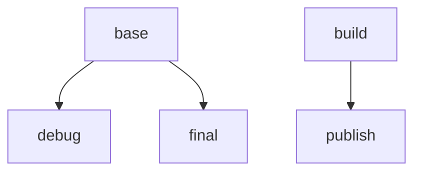

# Azure Linux Distroless Support

Distroless containers contain only the minimal set of packages your application needs, with anything extra removed (i.e. package manager, libraries and shell).
Both Qualys and Trivy support vulnerability scanning in Mariner distroless containers.

Due to their limited set of packages, distroless containers have a minimized security attack surface as well as reduced noise from vulnerability scanners.
This generally translates to a reduced overhead of patching vulnerabilities, allowing developers to focus on building their application.
Lastly, the smaller size provides higher performance.

Azure Linux distroless .NET images are available starting in .NET 6.
You can use the following image tags (SDK is not available for distroless):

- `mcr.microsoft.com/dotnet/<image-type>:6.0-cbl-mariner2.0-distroless`
- `mcr.microsoft.com/dotnet/<image-type>:8.0-cbl-mariner2.0-distroless`

## Installing Additional Packages

If you require additional packages to be installed in your Azure Linux Distroless image, you can follow the same pattern that .NET uses to install the .NET runtime dependencies.

```Dockerfile
FROM mcr.microsoft.com/dotnet/aspnet:6.0-cbl-mariner2.0-distroless AS base


FROM mcr.microsoft.com/cbl-mariner/base/core:2.0 AS installer

RUN tdnf install -y fdupes \
    && tdnf clean all

COPY --from=base / /staging1
COPY --from=base / /staging2

RUN tdnf install -y --releasever=2.0 --installroot /staging2 <package-name> \
    && tdnf clean all --releasever=2.0 --installroot /staging2

# Prepare the staging2 directory to be copied to the final stage by removing unnecessary files
# that will only cause extra image bloat.
RUN \
    # Remove duplicates from staging2 that exist in staging1
    fdupes /staging1 /staging2 -rdpN \
    \
    # Delete duplicate symlinks
    # Function to find and format symlinks w/o including root dir (format: /path/to/symlink /path/to/target)
    && getsymlinks() { find $1 -type l -printf '%p %l\n' | sed -n "s/^\\$1\\(.*\\)/\\1/p"; } \
    # Combine set of symlinks between staging1 and staging2
    && (getsymlinks "/staging1"; getsymlinks "/staging2") \
        # Sort them
        | sort \
        # Find the duplicates
        | uniq -d \
        # Extract just the path to the symlink
        | cut -d' ' -f1 \
        # Prepend the staging2 directory to the paths
        | sed -e 's/^/\/staging2/' \
        # Delete the files
        | xargs rm \
    \
    # General cleanup
    && rm -rf /staging2/etc/tdnf \
    && rm -rf /staging2/run/* \
    && rm -rf /staging2/var/cache/tdnf \
    && rm -rf /staging2/var/lib/rpm \
    && rm -rf /staging2/usr/share/doc \
    && rm -rf /staging2/usr/share/man \
    && find /staging2/var/log -type f -size +0 -delete \
    && find /staging2 -type d -empty -delete


FROM base

COPY --from=installer /staging2/ /
```

## Debugging with Container Fast Mode

To reduce both the size and attack surface of the Mariner image, the runtime images do not contain the tools required to debug the container using Visual Studio.
The easiest way to enable local Visual Studio debugging while not modifying the production image is to create a new stage based off the `base` stage (called `debug` in the example),
that contains the debugging tools, and then point the VS Fast Mode tools to that debug stage.

Here's an example chart showing the inheritance of the build stages: 



And here's an example configuration:

**.csproj**
```xml
<DockerfileFastModeStage>debug</DockerfileFastModeStage>
```

**Dockerfile**
```Dockerfile
# Learn about building .NET container images:
# https://github.com/dotnet/dotnet-docker/blob/main/samples/README.md
FROM mcr.microsoft.com/dotnet/aspnet:8.0-cbl-mariner2.0 as base
WORKDIR /app
EXPOSE 8080
EXPOSE 443


# this stage is used by VS for fast local debugging; it does not appear in the final image
FROM base AS debug
RUN tdnf install -y procps-ng # <-- Install tools needed for debugging (e.g. the `pidof` command)


# build stage
FROM --platform=$BUILDPLATFORM mcr.microsoft.com/dotnet/sdk:8.0-cbl-mariner2.0 AS build
ARG TARGETARCH
WORKDIR /source

# copy csproj and restore as distinct layers
COPY aspnetapp/*.csproj .
RUN dotnet restore -a $TARGETARCH

# copy and publish app and libraries
COPY aspnetapp/. .
RUN dotnet publish -a $TARGETARCH --no-restore -o /app


# final stage/image
FROM base AS final
COPY --from=build /app .
USER $APP_UID
ENTRYPOINT ["./aspnetapp"]
```

If this example doesn't work for your scenario, see [Container Tools build properties](https://docs.microsoft.com/en-us/visualstudio/containers/container-msbuild-properties?view=vs-2022) for more information on
customizing the Fast Mode stage, or setting a custom `DockerDebuggeeKillProgram`.
