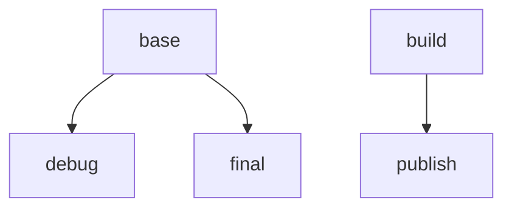

# Azure Linux

[Azure Linux](https://github.com/microsoft/AzureLinux) is an MIT-licensed, RPM-based Linux distribution published by Microsoft.
Azure Linux .NET images are [publicly supported](https://github.com/dotnet/dotnet-docker/discussions/5022) by Microsoft.

## Featured Tags

.NET 10

* `10.0-azurelinux3.0`
  * `docker pull mcr.microsoft.com/dotnet/sdk:10.0-azurelinux3.0`
  * `docker pull mcr.microsoft.com/dotnet/aspnet:10.0-azurelinux3.0`
  * `docker pull mcr.microsoft.com/dotnet/runtime:10.0-azurelinux3.0`
  * `docker pull mcr.microsoft.com/dotnet/runtime-deps:10.0-azurelinux3.0`

.NET 9

* `9.0-azurelinux3.0`
  * `docker pull mcr.microsoft.com/dotnet/sdk:9.0-azurelinux3.0`
  * `docker pull mcr.microsoft.com/dotnet/aspnet:9.0-azurelinux3.0`
  * `docker pull mcr.microsoft.com/dotnet/runtime:9.0-azurelinux3.0`
  * `docker pull mcr.microsoft.com/dotnet/runtime-deps:9.0-azurelinux3.0`

.NET 8

* `8.0-azurelinux3.0`
  * `docker pull mcr.microsoft.com/dotnet/sdk:8.0-azurelinux3.0`
  * `docker pull mcr.microsoft.com/dotnet/aspnet:8.0-azurelinux3.0`
  * `docker pull mcr.microsoft.com/dotnet/runtime:8.0-azurelinux3.0`
  * `docker pull mcr.microsoft.com/dotnet/runtime-deps:8.0-azurelinux3.0`

## Azure Linux Distroless

Azure Linux distroless .NET images contain only the minimal set of packages .NET needs, with everything else removed.
See the [distroless .NET containers documentation](./distroless.md) for more info.

Azure Linux distroless .NET images are available for all supported .NET versions in the following image repos:

* [`mcr.microsoft.com/dotnet/runtime`](../README.runtime.md)
* [`mcr.microsoft.com/dotnet/aspnet`](../README.aspnet.md)
* [`mcr.microsoft.com/dotnet/runtime-deps`](../README.runtime-deps.md) (for self-contained or AOT apps)

You can use the following image tags:

* `10.0-azurelinux3.0-distroless`
* `9.0-azurelinux3.0-distroless`
* `8.0-azurelinux3.0-distroless`

### Installing Additional Packages

If your app requires additional packages besides `icu` and `tzdata`, you can follow the same pattern that .NET uses to install the .NET runtime dependencies.

```Dockerfile
FROM mcr.microsoft.com/dotnet/nightly/aspnet:10.0-azurelinux3.0-distroless AS base

FROM mcr.microsoft.com/azurelinux/base/core:3.0 AS installer

RUN tdnf install -y fdupes \
    && tdnf clean all

COPY --from=base / /staging1
COPY --from=base / /staging2

RUN tdnf install -y --releasever=3.0 --installroot /staging2 tzdata \
    && tdnf clean all --releasever=3.0 --installroot /staging2

# Prepare the staging2 directory to be copied to the final stage by removing unnecessary files
# that will only cause extra image bloat.
RUN \
    # Remove duplicates from staging2 that exist in staging1
    fdupes /staging1 /staging2 -rdpN \
    \
    # Delete duplicate symlinks
    # Function to find and format symlinks w/o including root dir (format: /path/to/symlink /path/to/target)
    && getsymlinks() { find $1 -type l -printf '%p %l\n' | sed -n "s/^\\$1\\(.*\\)/\\1/p"; } \
    # Combine set of symlinks between staging1 and staging2
    && (getsymlinks "/staging1"; getsymlinks "/staging2") \
        # Sort them
        | sort \
        # Find the duplicates
        | uniq -d \
        # Extract just the path to the symlink
        | cut -d' ' -f1 \
        # Prepend the staging2 directory to the paths
        | sed -e 's/^/\/staging2/' \
        # Delete the files
        | xargs rm \
    \
    # General cleanup
    && rm -rf /staging2/etc/tdnf \
    && rm -rf /staging2/run/* \
    && rm -rf /staging2/var/cache/tdnf \
    && rm -rf /staging2/var/lib/rpm \
    && rm -rf /staging2/usr/share/doc \
    && rm -rf /staging2/usr/share/man \
    && find /staging2 -type d -empty -delete

FROM base
COPY --from=installer /staging2/ /
```

## Debugging with Container Fast Mode

In order to reduce image size and attack surface, Azure Linux .NET Runtime images do not contain the tools required to debug .NET apps using Visual Studio.
The easiest way to enable local Visual Studio debugging while not modifying the production image is to use [Container Fast Mode](https://learn.microsoft.com/en-us/visualstudio/containers/container-build#debugging).

To enable Container Fast Mode debugging without affecting your app's production image, you can create a new stage based off the `base` stage (called `debug` in the example) that contains the debugging tools, and then point the VS Fast Mode tools to that debug stage.

Here's an example chart showing the inheritance of the build stages:



Here's an example configuration based off of a simple ASP.NET Core app:

### *.csproj

```diff
<PropertyGroup>
  ...
+ <DockerfileFastModeStage>debug</DockerfileFastModeStage>
  ...
</PropertyGroup>
```

### Dockerfile

```diff
# Learn about building .NET container images:
# https://github.com/dotnet/dotnet-docker/blob/main/samples/README.md
FROM mcr.microsoft.com/dotnet/aspnet:10.0-azurelinux3.0 AS base
- USER $APP_UID
WORKDIR /app
EXPOSE 8080
EXPOSE 8081

+ # this stage is used by VS for fast local debugging; it does not appear in the final image
+ FROM base AS debug
+ RUN tdnf install -y procps-ng # <-- Install tools needed for debugging (e.g. the `pidof` command)

FROM mcr.microsoft.com/dotnet/sdk:10.0-azurelinux3.0 AS build
ARG BUILD_CONFIGURATION=Release
WORKDIR /src
COPY ["aspnetapp/aspnetapp.csproj", "aspnetapp/"]
RUN dotnet restore "./aspnetapp/aspnetapp.csproj"
COPY . .
WORKDIR "/src/aspnetapp"
RUN dotnet build "./aspnetapp.csproj" -c $BUILD_CONFIGURATION -o /app/build

FROM build AS publish
ARG BUILD_CONFIGURATION=Release
RUN dotnet publish "./aspnetapp.csproj" -c $BUILD_CONFIGURATION -o /app/publish /p:UseAppHost=false

FROM base AS final
WORKDIR /app
COPY --from=publish /app/publish .
+ # Make sure non-root user is enabled after the debug stage so that we have permission to install the debug dependencies
+ USER $APP_UID
ENTRYPOINT ["dotnet", "aspnetapp.dll"]
```

If this example doesn't work for your scenario, see [Container Tools build properties](https://docs.microsoft.com/en-us/visualstudio/containers/container-msbuild-properties?view=vs-2022) for more information on
customizing the Fast Mode stage, or setting a custom `DockerDebuggeeKillProgram`.
