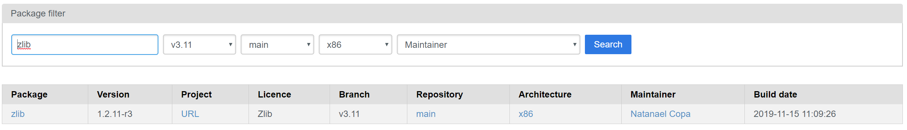
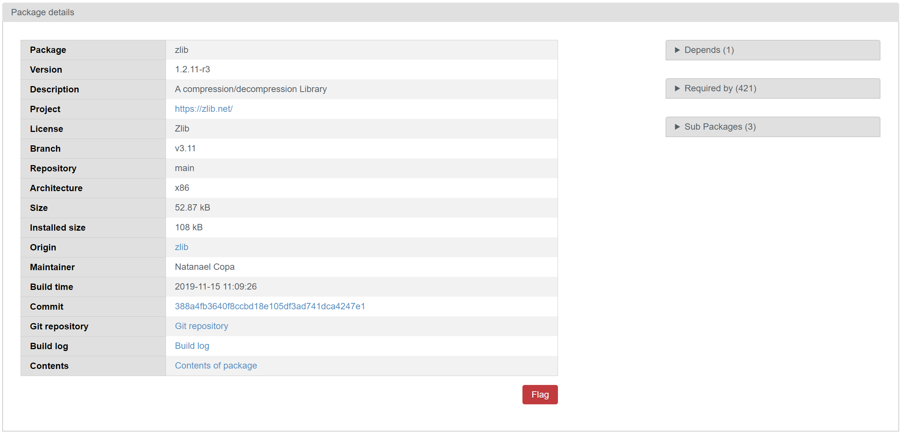

# .NET Core Image Artifact Details

.NET Core container images contain multiple software components, each built from different source and with different licensing. It is important that users of these images can determine the license requirements of these images and have a link back to the source for copyright and pedigree purposes.

This document is intended to be informative, primarily defining patterns for discovering license and pedigree information and describing expectations (whether the desired information can be found within the images). It does not list all of the license and pedigree information you might want. This information can change at any time, which also demonstrates why using the documented patterns is important.

This document focuses solely on open source Linux distros. Windows is out of scope because it is a proprietary licensed OS.

This document answers two basic questions:

* How can I interrogate an image to determine licensing and version information of the packages and components it includes?
* Where can I look to learn about source pedigree information for an image from external sources (since it is difficult/impossible to learn everything from an image)?

The combination of [.NET Core Dockerfiles](https://github.com/dotnet/dotnet-docker) and [.NET Core container images](https://hub.docker.com/_/microsoft-dotnet-core/) are the source and binary artifacts that are used in this document and intended to be used to determine the compliance of .NET Core containers.

This document describes the licensing and source pedigree of the following components:

* Base images (from Docker Hub)
* Packages (from Linux package managers)
* .NET Core and other components (acquired as .tar.gz/.zip files)

## Base Images used by .NET Core Images

.NET Core images are provided for a set of Linux distros, delivered via [MCR](https://azure.microsoft.com/blog/microsoft-syndicates-container-catalog/) (and advertised on Docker Hub). The Linux distros are acquired from Docker Hub as part of building the .NET Core images. The following base images are delivered as a component of .NET Core images:

* [alpine](https://hub.docker.com/_/alpine)
* [debian](https://hub.docker.com/_/debian)
* [ubuntu](https://hub.docker.com/_/ubuntu)
* [buildpack-deps](https://hub.docker.com/_/buildpack-deps)

.NET Core is dependent on those images, and the individuals/organizations that build them, to satisfactorily describe the licensing and pedigree of these images.

## Retrieving Package Information From Base Images

The practices to retrieve package information vary across the distro types that .NET Core depends on. This is demonstrated via the following introspection technique, for each of the supported distros.

Note: The output of the commands is intentionally cut-off for purposes of brevity. The output you see below is intended to demonstrate the pattern, and you can repeat it to view all current license information for the base image of your choosing.

### alpine

You can retrieve the full list of packages installed within Alpine images, as demonstrated below.

```console
$ docker run --rm alpine:3.11 apk list -I
musl-1.1.24-r0 x86_64 {musl} (MIT) [installed]
zlib-1.2.11-r3 x86_64 {zlib} (Zlib) [installed]
apk-tools-2.10.4-r3 x86_64 {apk-tools} (GPL2) [installed]
musl-utils-1.1.24-r0 x86_64 {musl} (MIT BSD GPL2+) [installed]
libssl1.1-1.1.1d-r2 x86_64 {openssl} (OpenSSL) [installed]
alpine-baselayout-3.2.0-r3 x86_64 {alpine-baselayout} (GPL-2.0-only) [installed]
alpine-keys-2.1-r2 x86_64 {alpine-keys} (MIT) [installed]
busybox-1.31.1-r8 x86_64 {busybox} (GPL-2.0-only) [installed]
scanelf-1.2.4-r0 x86_64 {pax-utils} (GPL-2.0-only) [installed]
libc-utils-0.7.2-r0 x86_64 {libc-dev} (BSD) [installed]
libtls-standalone-2.9.1-r0 x86_64 {libtls-standalone} (ISC) [installed]
ssl_client-1.31.1-r8 x86_64 {busybox} (GPL-2.0-only) [installed]
ca-certificates-cacert-20191127-r0 x86_64 {ca-certificates} (MPL-2.0 GPL-2.0-or-later) [installed]
libcrypto1.1-1.1.1d-r2 x86_64 {openssl} (OpenSSL) [installed]
```

The package listing above includes the license in the fourth cell. You can also retrieve the license for any single package, as demonstrated below. This example retrieves the `musl` license from the `alpine:3.11` image.

```console
$ docker run --rm alpine:3.11 apk info --license musl
musl-1.1.24-r0 license:
MIT
```

You can retrieve the source for any package by looking up the package on the [alpine package website](https://pkgs.alpinelinux.org/packages).  You must enter the package name, branch (which corresponds to the Alpine version), and architecture. Finding the [information for the `zlib` package](https://pkgs.alpinelinux.org/packages?name=zlib&branch=v3.11&repo=main&arch=x86) is demonstrated below.



Navigating the [Package link](https://pkgs.alpinelinux.org/package/v3.11/main/x86/zlib) will show detailed package information including the originating source amongst other information.



### debian

You can retrieve the full list of packages installed within Debian images, as demonstrated below.

```console
$ docker run --rm debian:buster-slim dpkg-query -l
Desired=Unknown/Install/Remove/Purge/Hold
| Status=Not/Inst/Conf-files/Unpacked/halF-conf/Half-inst/trig-aWait/Trig-pend
|/ Err?=(none)/Reinst-required (Status,Err: uppercase=bad)
||/ Name                    Version                Architecture Description
+++-=======================-======================-============-========================================================================
ii  adduser                 3.118                  all          add and remove users and groups
ii  apt                     1.8.2                  amd64        commandline package manager
ii  base-files              10.3+deb10u2           amd64        Debian base system miscellaneous files
ii  base-passwd             3.5.46                 amd64        Debian base system master password and group files
ii  bash                    5.0-4                  amd64        GNU Bourne Again SHell
ii  bsdutils                1:2.33.1-0.1           amd64        basic utilities from 4.4BSD-Lite
ii  coreutils               8.30-3                 amd64        GNU core utilities
ii  dash                    0.5.10.2-5             amd64        POSIX-compliant shell
ii  debconf                 1.5.71                 all          Debian configuration management system
ii  debian-archive-keyring  2019.1                 all          GnuPG archive keys of the Debian archive
...
```

You can retrieve the license for any package, as demonstrated below. This example retrieves the `apt` license from the `debian:buster-slim` image by performing the following steps with a single command:

1. List out the package contents
1. Find the copyright file
1. Print out the copyright file contents

```console
$ docker run --rm debian:buster-slim sh -c 'cat `dpkg -L apt | grep copyright`'
Apt is copyright 1997, 1998, 1999 Jason Gunthorpe and others.
Apt is currently developed by APT Development Team <deity@lists.debian.org>.

License: GPLv2+

    This program is free software; you can redistribute it and/or modify
    it under the terms of the GNU General Public License as published by
    the Free Software Foundation; either version 2 of the License, or
    (at your option) any later version.

    This program is distributed in the hope that it will be useful,
    but WITHOUT ANY WARRANTY; without even the implied warranty of
    MERCHANTABILITY or FITNESS FOR A PARTICULAR PURPOSE.  See the
    GNU General Public License for more details.

    You should have received a copy of the GNU General Public License
    along with this program; if not, write to the Free Software
    Foundation, Inc., 51 Franklin St, Fifth Floor, Boston, MA 02110-1301, USA.

See /usr/share/common-licenses/GPL-2, or
<http://www.gnu.org/copyleft/gpl.txt> for the terms of the latest version
of the GNU General Public License.
```

You can retrieve the source for package, as demonstrated below. This example retrieves the `apt` source from the `debian:buster-slim` image by performing the following steps with a single command:

1. Add the source feeds for the existing package feeds.
1. Utilize the [`apt-get`](https://manpages.debian.org/buster/apt/apt-get.8.en.html) tool to print out the URIs of archive files that contain the package source. See the [`apt-get source`](https://manpages.debian.org/buster/apt/apt-get.8.en.html) documentation for additional options.

```console
$ docker run --rm debian:buster-slim sh -c "find /etc/apt/sources.list* -type f -exec sed -i -e 'p; s/^deb /deb-src /' '{}' + && apt-get update -qq && apt-get source -qq --print-uris apt=1.8.2"
'http://deb.debian.org/debian/pool/main/a/apt/apt_1.8.2.dsc' apt_1.8.2.dsc 2766 SHA256:891cc952f028b79e2eace3db6c19d55dee247ac19d934bbe43c3921104b01c3b
'http://deb.debian.org/debian/pool/main/a/apt/apt_1.8.2.tar.xz' apt_1.8.2.tar.xz 2188344 SHA256:7f9a91c26624bc85733683ee239b0c0d971a593d670855cf7bcf693b08a37734
```

### ubuntu

You can retrieve the full list of packages installed within Ubuntu images, as demonstrated below.

```console
$ docker run --rm ubuntu:bionic dpkg-query -l
Desired=Unknown/Install/Remove/Purge/Hold
| Status=Not/Inst/Conf-files/Unpacked/halF-conf/Half-inst/trig-aWait/Trig-pend
|/ Err?=(none)/Reinst-required (Status,Err: uppercase=bad)
||/ Name                              Version               Architecture          Description
+++-=================================-=====================-=====================-=======================================================================
ii  adduser                           3.116ubuntu1          all                   add and remove users and groups
ii  apt                               1.6.12                amd64                 commandline package manager
ii  base-files                        10.1ubuntu2.7         amd64                 Debian base system miscellaneous files
ii  base-passwd                       3.5.44                amd64                 Debian base system master password and group files
ii  bash                              4.4.18-2ubuntu1.2     amd64                 GNU Bourne Again SHell
ii  bsdutils                          1:2.31.1-0.4ubuntu3.4 amd64                 basic utilities from 4.4BSD-Lite
ii  bzip2                             1.0.6-8.1ubuntu0.2    amd64                 high-quality block-sorting file compressor - utilities
ii  coreutils                         8.28-1ubuntu1         amd64                 GNU core utilities
ii  dash                              0.5.8-2.10            amd64                 POSIX-compliant shell
ii  debconf                           1.5.66ubuntu1         all                   Debian configuration management system
...
```

You can retrieve the license for any package, as demonstrated below. This example retrieves the `apt` license from the `ubuntu:bionic` image by performing the following steps with a single command:

1. List out the package contents
1. Find the copyright file
1. Print out the copyright file contents

```console
$ docker run --rm ubuntu:bionic sh -c 'cat `dpkg -L apt | grep copyright`'
Apt is copyright 1997, 1998, 1999 Jason Gunthorpe and others.
Apt is currently developed by APT Development Team <deity@lists.debian.org>.

License: GPLv2+

    This program is free software; you can redistribute it and/or modify
    it under the terms of the GNU General Public License as published by
    the Free Software Foundation; either version 2 of the License, or
    (at your option) any later version.

    This program is distributed in the hope that it will be useful,
    but WITHOUT ANY WARRANTY; without even the implied warranty of
    MERCHANTABILITY or FITNESS FOR A PARTICULAR PURPOSE.  See the
    GNU General Public License for more details.

    You should have received a copy of the GNU General Public License
    along with this program; if not, write to the Free Software
    Foundation, Inc., 51 Franklin St, Fifth Floor, Boston, MA 02110-1301, USA.

See /usr/share/common-licenses/GPL-2, or
<http://www.gnu.org/copyleft/gpl.txt> for the terms of the latest version
of the GNU General Public License.
```

You can retrieve the source for package, as demonstrated below. This example retrieves the `apt` source from the `ubuntu:bionic` image by performing the following steps with a single command:

1. Add the source feeds for the existing package feeds.
1. Utilize the [`apt-get`](https://manpages.debian.org/buster/apt/apt-get.8.en.html) tool to print out the URIs of archive files that contain the package source. See the [`apt-get source`](https://manpages.debian.org/buster/apt/apt-get.8.en.html) documentation for additional options.

```console
$ docker run --rm ubuntu:bionic sh -c "find /etc/apt/sources.list* -type f -exec sed -i -e 'p; s/^deb /deb-src /' '{}' + && apt-get update -qq && apt-get source -qq --print-uris apt=1.6.12"
'http://archive.ubuntu.com/ubuntu/pool/main/a/apt/apt_1.6.12.dsc' apt_1.6.12.dsc 2796 SHA256:061d7de8e9faea48b69b37f01a54b2eac04d39eaab143ec4ffb7cd534fa01cfd
'http://archive.ubuntu.com/ubuntu/pool/main/a/apt/apt_1.6.12.tar.xz' apt_1.6.12.tar.xz 2171176 SHA256:d4e2ae405a1ff12bd108a5a530a24d52afde9cde40065ed508fdea33302c8a35
```

### buildpack-deps

.NET Core uses the Debian and Ubuntu variants of [`buildpack-deps`](https://hub.docker.com/_/buildpack-deps), enabling you to use the same patterns described above to retrieve the licensing information for these images.

## Retrieving Pedigree Information for Base Images

.NET Core relies on the official Docker image repositories to provide detailed information about the images. This information includes layer information, source code, license information, etc. This information is stored in the [Official Images "Extended Information" repository](https://github.com/docker-library/repo-info) and is split into two types:

* remote
  * gathered from the Docker Hub/Registry API
  * image digests/blobs, transfer sizes, image metadata, etc.
* local
  * inspected from the image on-disk after it is pulled
  * installed packages, creation date, architecture, environment variables, detected licenses, etc.

An abbreviated copy of the "extended information" for the `debian:buster-slim` image is included below, first the [remote](https://github.com/docker-library/repo-info/blob/master/repos/debian/remote/buster-slim.md) and then the [local](https://github.com/docker-library/repo-info/blob/master/repos/debian/local/buster-slim.md) information.

### `debian:buster-slim` (remote)

```console
$ docker pull debian@sha256:e4c1417236abc57971755ca2bfccd546cbca45b33daf66001a5addae4bf78517
```

* Manifest MIME: `application/vnd.docker.distribution.manifest.list.v2+json`
* Platforms:
  * linux; amd64
  * linux; arm variant v5
  * linux; arm variant v7
  * linux; arm64 variant v8
  * linux; 386
  * linux; ppc64le
  * linux; s390x

#### `debian:buster-slim` - linux; amd64

```console
$ docker pull debian@sha256:0c679627b3a61b2e3ee902ec224b0505839bc2ad76d99530e5f0566e47ac8400
```

* Docker Version: 18.06.1-ce
* Manifest MIME: `application/vnd.docker.distribution.manifest.v2+json`
* Total Size: **27.1 MB (27092274 bytes)**  
* (compressed transfer size, not on-disk size)
* Image ID: `sha256:e1af56d072b8d93fce4b566f4bf76311108dbbbe952b12a85418bd32c2fcdda7`
* Default Command: `["bash"]`

```dockerfile
# Sat, 28 Dec 2019 04:21:22 GMT
ADD file:04caaf303199c81ff1a94e2e39d5096f9d02b73294b82758e5bc6e23aff94272 in /
# Sat, 28 Dec 2019 04:21:23 GMT
CMD ["bash"]
```

* Layers:
  * `sha256:8ec398bc03560e0fa56440e96da307cdf0b1ad153f459b52bca53ae7ddb8236d`
  * Last Modified: Sat, 28 Dec 2019 04:25:53 GMT  
  * Size: 27.1 MB (27092274 bytes)  
  * MIME: application/vnd.docker.image.rootfs.diff.tar.gzip

...

### `debian:buster-slim` (local)

#### Docker Metadata

* Image ID: `sha256:e1af56d072b8d93fce4b566f4bf76311108dbbbe952b12a85418bd32c2fcdda7`
* Created: `2019-12-28T04:21:23.037912523Z`
* Virtual Size: ~ 69.21 Mb  
  (total size of all layers on-disk)
* Arch: `linux`/`amd64`
* Command: `["bash"]`
* Environment:
  * `PATH=/usr/local/sbin:/usr/local/bin:/usr/sbin:/usr/bin:/sbin:/bin`

#### `dpkg` (`.deb`-based packages)

##### `dpkg` source package: `acl=2.2.53-4`

Binary Packages:

* `libacl1:amd64=2.2.53-4`

Licenses: (parsed from: `/usr/share/doc/libacl1/copyright`)

* `GPL-2`
* `GPL-2+`
* `LGPL-2+`
* `LGPL-2.1`

Source:

```console
$ apt-get source -qq --print-uris acl=2.2.53-4
'http://deb.debian.org/debian/pool/main/a/acl/acl_2.2.53-4.dsc' acl_2.2.53-4.dsc 2330 SHA256:532eb4029659db74e6625adc2bd277144f33c92cb0603272d61693b069896a85
'http://deb.debian.org/debian/pool/main/a/acl/acl_2.2.53.orig.tar.gz' acl_2.2.53.orig.tar.gz 524300 SHA256:06be9865c6f418d851ff4494e12406568353b891ffe1f596b34693c387af26c7
'http://deb.debian.org/debian/pool/main/a/acl/acl_2.2.53.orig.tar.gz.asc' acl_2.2.53.orig.tar.gz.asc 833 SHA256:06849bece0b56a6a7269173abe101cff223bb9346d74027a3cd5ff80914abf4b
'http://deb.debian.org/debian/pool/main/a/acl/acl_2.2.53-4.debian.tar.gz.asc' acl_2.2.53-4.debian.tar.xz 18572 SHA256:3e6571adea4886a9549bdc2323d5c55ee8f7dafb6a204513111d5943d2776dd8
```

Other potentially useful URLs:

* https://sources.debian.net/src/acl/2.2.53-4/ (for browsing the source)
* https://sources.debian.net/src/acl/2.2.53-4/debian/copyright/ (for direct copyright/license information)
* http://snapshot.debian.org/package/acl/2.2.53-4/ (for access to the source package after it no longer exists in the archive)

##### `dpkg` source package: `adduser=3.118`

...

### Pedigree Information for Base Images used by .NET Core Images

The following links provide the pedigree information for the .NET Core Linux base images.

* [alpine](https://hub.docker.com/_/alpine)
  * [local](https://github.com/docker-library/repo-info/blob/master/repos/alpine/local/)
  * [remote](https://github.com/docker-library/repo-info/blob/master/repos/alpine/remote/)
* [debian](https://hub.docker.com/_/debian)
  * [local](https://github.com/docker-library/repo-info/blob/master/repos/debian/local/)
  * [remote](https://github.com/docker-library/repo-info/blob/master/repos/debian/remote/)
* [ubuntu](https://hub.docker.com/_/ubuntu)
  * [local](https://github.com/docker-library/repo-info/blob/master/repos/ubuntu/local/)
  * [remote](https://github.com/docker-library/repo-info/blob/master/repos/ubuntu/remote/)
* [buildpack-deps](https://hub.docker.com/_/buildpack-deps)
  * [local](https://github.com/docker-library/repo-info/blob/master/repos/buildpack-deps/local/)
  * [remote](https://github.com/docker-library/repo-info/blob/master/repos/buildpack-deps/remote/)

## Additional Packages

.NET Core images install a set of packages (from the associated package manager for the distro).

You can see an example of these packages in this [runtime-deps](https://hub.docker.com/_/microsoft-dotnet-core-runtime-deps) Dockerfile, which is copied below (see `RUN apt-get` instruction).

```Dockerfile
FROM debian:buster-slim

RUN apt-get update \
    && apt-get install -y --no-install-recommends \
        ca-certificates \
        \
# .NET Core dependencies
        libc6 \
        libgcc1 \
        libgssapi-krb5-2 \
        libicu63 \
        libssl1.1 \
        libstdc++6 \
        zlib1g \
    && rm -rf /var/lib/apt/lists/*

# Configure web servers to bind to port 80 when present
ENV ASPNETCORE_URLS=http://+:80 \
    # Enable detection of running in a container
    DOTNET_RUNNING_IN_CONTAINER=true
```

There is no guarantee that the these packages are not present in the base image, but it typically will not be (hence why it is explicitly installed), as is demonstrated below.

```console
$ docker run --rm debian:buster-slim apt list ca-certificates
Listing...
$ docker run --rm mcr.microsoft.com/dotnet/core/runtime-deps:3.1-buster-slim apt list ca-certificates
Listing...
ca-certificates/now 20190110 all [installed,local]
```

The patterns for [Retrieving Package Information From Base Images](#retrieving-package-information-from-base-images) can be repeated for packages that are added in .NET Core images (above and beyond the base image).

## .NET Core and Other Components

.NET Core and other components are carried in .NET Core images, all of which are from Microsoft or the .NET Foundation. The following list describes the complete set of other software (beyond base images and packages):

* .NET Core Runtime
* ASP.NET Core Runtime
* .NET Core SDK
* PowerShell

You can see these components installed in the [runtime](https://github.com/dotnet/dotnet-docker/blob/d4a9e799d047f3e86cd2730f48b689c371d38480/3.1/runtime/buster-slim/amd64/Dockerfile#L9-L17), [aspnet](https://github.com/dotnet/dotnet-docker/blob/d4a9e799d047f3e86cd2730f48b689c371d38480/3.1/aspnet/buster-slim/amd64/Dockerfile#L4-10), and [sdk](https://github.com/dotnet/dotnet-docker/blob/d4a9e799d047f3e86cd2730f48b689c371d38480/3.1/sdk/buster/amd64/Dockerfile#L26-L49) Dockefiles.

You can discover the licenses for these components using the following pattern.

### .NET Core Runtime Image

The [.NET Core runtime image](https://hub.docker.com/_/microsoft-dotnet-core-runtime/) includes the .NET Core runtime, with an associated license and third party notice file.

```console
$ docker run --rm mcr.microsoft.com/dotnet/core/runtime:3.1-buster-slim find ./usr/share/dotnet | grep LICENSE
./usr/share/dotnet/LICENSE.txt
```

The license can be printed out, as follows.

```console
$ docker run --rm mcr.microsoft.com/dotnet/core/runtime:3.1-buster-slim cat ./usr/share/dotnet/LICENSE.txt
The MIT License (MIT)

Copyright (c) .NET Foundation and Contributors

All rights reserved.

Permission is hereby granted, free of charge, to any person obtaining a copy
of this software and associated documentation files (the "Software"), to deal
in the Software without restriction, including without limitation the rights
to use, copy, modify, merge, publish, distribute, sublicense, and/or sell
copies of the Software, and to permit persons to whom the Software is
furnished to do so, subject to the following conditions:

...
```

Third party notices can also be found, as demonstrated below.

```console
$ docker run --rm mcr.microsoft.com/dotnet/core/runtime:3.1-buster-slim find ./usr/share/dotnet | grep -i third
./usr/share/dotnet/ThirdPartyNotices.txt
```

### .NET Core ASP.NET Image

The [ASP.NET image](https://hub.docker.com/_/microsoft-dotnet-core-aspnet/) includes ASP.NET Core in addition to .NET Core, with associated licenses and third party notice files.

```console
% docker run --rm mcr.microsoft.com/dotnet/core/aspnet:3.1-buster-slim find ./usr/share/dotnet | grep LICENSE
./usr/share/dotnet/LICENSE.txt
% docker run --rm mcr.microsoft.com/dotnet/core/aspnet:3.1-buster-slim find ./usr/share/dotnet | grep -i third
./usr/share/dotnet/ThirdPartyNotices.txt
./usr/share/dotnet/shared/Microsoft.AspNetCore.App/3.1.0/THIRD-PARTY-NOTICES.txt
```

### .NET Core SDK Image

The [SDK image](https://hub.docker.com/_/microsoft-dotnet-core-sdk/) includes the .NET Core SDK, which includes various .NET Core components, with associated licenses and third party notice files.

Note: The SDK image is based on [`buildpack-deps`](https://hub.docker.com/_/buildpack-deps), which includes components that we distribute but do not use (like Python).

```console
$ docker run --rm mcr.microsoft.com/dotnet/core/sdk:3.1-buster find ./usr/share/dotnet ./usr/share/powershell | grep LICENSE
./usr/share/dotnet/sdk/3.1.100/Sdks/Microsoft.NET.Sdk.WindowsDesktop/LICENSE.TXT
./usr/share/dotnet/LICENSE.txt
./usr/share/powershell/.store/powershell.linux.x64/7.0.0-preview.6/powershell.linux.x64/7.0.0-preview.6/tools/netcoreapp3.1/any/LICENSE.txt
$ docker run --rm mcr.microsoft.com/dotnet/core/sdk:3.1-buster find ./usr/share/dotnet | grep -i third
./usr/share/dotnet/sdk/3.1.100/Sdks/Microsoft.NET.Sdk.WindowsDesktop/THIRD-PARTY-NOTICES.TXT
./usr/share/dotnet/ThirdPartyNotices.txt
./usr/share/dotnet/shared/Microsoft.AspNetCore.App/3.1.0/THIRD-PARTY-NOTICES.txt
$ docker run --rm mcr.microsoft.com/dotnet/core/sdk:3.1-buster find ./usr/share/dotnet ./usr/share/powershell | grep -i third
./usr/share/powershell/.store/powershell.linux.x64/7.0.0-preview.6/powershell.linux.x64/7.0.0-preview.6/tools/netcoreapp3.1/any/ThirdPartyNotices.txt
```

Python also provides third party notice files, via `buildpack-deps`. You will see those if you use the following (unfiltered) pattern:

```console
% docker run --rm mcr.microsoft.com/dotnet/core/sdk:3.1 find . | grep -i third
./usr/share/powershell/.store/powershell.linux.x64/7.0.0-preview.6/powershell.linux.x64/7.0.0-preview.6/tools/netcoreapp3.1/any/ThirdPartyNotices.txt
./usr/share/dotnet/ThirdPartyNotices.txt
./usr/share/dotnet/sdk/3.1.100/Sdks/Microsoft.NET.Sdk.WindowsDesktop/THIRD-PARTY-NOTICES.TXT
./usr/share/dotnet/shared/Microsoft.AspNetCore.App/3.1.0/THIRD-PARTY-NOTICES.txt
./usr/lib/python2.7/dist-packages/mercurial/thirdparty
./usr/lib/python2.7/dist-packages/mercurial/thirdparty/cbor
./usr/lib/python2.7/dist-packages/mercurial/thirdparty/cbor/__init__.py
./usr/lib/python2.7/dist-packages/mercurial/thirdparty/cbor/cbor2
...
```
