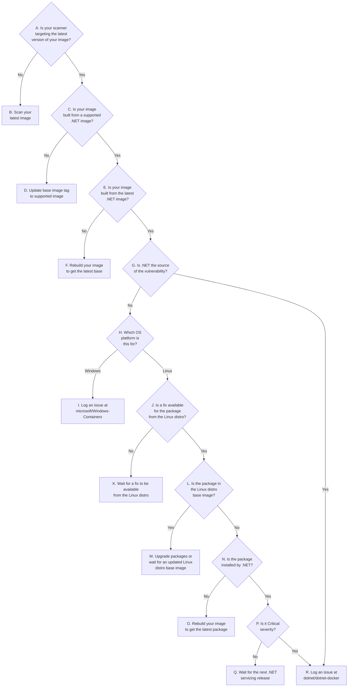

# Container Vulnerability Workflow

This document is intended to help guide you to the appropriate course of action when encountering reported vulnerabilities in the .NET container images.
We rebuild images on a regular basis in response to CVEs and base image updates according to our [Image Update Policy](../README.md#image-update-policy).
Before logging an issue, please review this document and follow the recommended steps.

Prerequisites:

* Dockerfile of the container image being reported upon
  * Name of the .NET image the Dockerfile is based on (e.g. `mcr.microsoft.com/dotnet/aspnet:8.0`)
* Architecture of the container image being reported upon (e.g. `amd64`)
* [Docker installation](https://docs.docker.com/desktop) to run commands locally
* Whether the container image is a [Linux or Windows image](#how-can-i-determine-whether-my-image-is-based-on-linux-or-windows)
  * For Linux images, it's also important to [know the Linux distro and version](#how-can-i-determine-the-os-version-of-a-linux-image) (e.g. `Debian Bookworm`, `Alpine 3.20`, `Ubuntu Noble`, `Azure Linux 3.0`)
* If you're using Docker Desktop for Windows and investigating a vulnerability in a Linux image, [change your settings](https://docs.docker.com/desktop/settings/windows/) to target Linux containers.

The flowchart below describes a series of questions to help determine the state of the image being reported upon.
By answering each question, it will eventually direct you to the action to help resolve your vulnerabilities.
The flowchart is meant to be a visual representation of the workflow.
Below the flowchart are the details of each question and the actions to take.
Each question in the details section includes a "Response" header that contains links to help guide you through the workflow based on your responses.
You may begin with the first question at "[A. Is your scanner targeting the latest version of your image?](#a-is-your-scanner-targeting-the-latest-version-of-your-image)"



## Flowchart Details

### A. Is your scanner targeting the latest version of your image?

There's no need to spend time analyzing vulnerabilities if the scan results are not based on the latest image.
Each build of an image can potentially bring in newly released package versions which have fixes for the vulnerabilities.

Most image scanning software will output the [image digest](#what-is-an-image-digest) of the image that is being scanned in its report or logs.
Be sure that that digest represents the latest version of your image.
To determine what the latest digest of your image is run the script below.

#### macOS/Linux

Requires [PowerShell to be installed](https://learn.microsoft.com/powershell/scripting/install/installing-powershell-on-linux).

```shell
myImage="<insert-my-image-tag>"
curl -sSL https://raw.githubusercontent.com/dotnet/dotnet-docker/main/documentation/scripts/resolve-image-digest.ps1 | pwsh /dev/stdin $myImage
```

#### Windows

```powershell
$myImage="<insert-my-image-tag>"
[Net.ServicePointManager]::SecurityProtocol = [Net.SecurityProtocolType]::Tls12
&([scriptblock]::Create((Invoke-WebRequest -UseBasicParsing 'https://raw.githubusercontent.com/dotnet/dotnet-docker/main/documentation/scripts/resolve-image-digest.ps1'))) $myImage
```

#### Resolving multi-arch tags

If the script above returns an error indicating it's unable to resolve a multi-arch tag, you'll need to provide extra parameters to the script.
The following scripts indicate how to do that.

If you're targeting Windows containers, you'll need to determine the Windows build number of the image you're targeting.
To do this, find the Windows version number that is listed on the [Windows Docker Hub page](https://hub.docker.com/_/microsoft-windows-nanoserver).
For example, if you're targeting Windows Server 2022 LTSC, look for the `ltsc2022` tag and find its corresponding build number in the OS Version column.
You only need the first three parts of the version number.
In the case of Windows Server 2022, it's `10.0.20348`.
You can use a wildcard to indicate the rest of the version number.

##### macOS/Linux

Requires [PowerShell to be installed](https://learn.microsoft.com/powershell/scripting/install/installing-powershell-on-linux).

```shell
myImage="<insert-my-image-tag>"
os="<linux|windows>" # choose "linux" or "windows"
arch="<amd64|arm|arm64>" # choose the architecture of your image
osVersion="<windows-version>" # Only used for Windows containers (e.g. "10.0.20348.*"). For Linux, leave this blank.
curl -sSL https://raw.githubusercontent.com/dotnet/dotnet-docker/main/documentation/scripts/resolve-image-digest.ps1 | pwsh /dev/stdin $myImage -Os $os -Architecture $arch -OsVersion $osVersion
```

##### Windows

```powershell
$myImage="<insert-my-image-tag>"
$os="<linux|windows>" # choose "linux" or "windows"
$arch="<amd64|arm|arm64>" # choose the architecture of your image
osVersion="<windows-version>" # Only used for Windows containers (e.g. "10.0.20348.*"). For Linux, leave this blank.
[Net.ServicePointManager]::SecurityProtocol = [Net.SecurityProtocolType]::Tls12
&([scriptblock]::Create((Invoke-WebRequest -UseBasicParsing 'https://raw.githubusercontent.com/dotnet/dotnet-docker/main/documentation/scripts/resolve-image-digest.ps1'))) $myImage -Os $os -Architecture $arch -OsVersion $osVersion
```

#### Response

* `Yes`: go to "[B. Scan your latest image](#b-scan-your-latest-image)"
* `No`: go to "[C. Is your image built from a supported .NET tag?](#c-is-your-image-built-from-a-supported-net-tag)"

### B. Scan your latest image

Rerun the scan of your image using your scanning tool. Ensure you get the latest version of the image by running `docker pull <image-tag>`

### C. Is your image built from a supported .NET tag?

When .NET drops support for an image tag, it means it will no longer be updated, even when there is a new base OS image available.
This means that vulnerabilities will be reported for that image over time if it continues to be used.
Our [supported tag policy](supported-tags.md) provides detailed information about when these tags are no longer supported.
The simple rule to follow: only the tags shown in our [tag listing](supported-tags.md#tag-listing) are supported.

This script can be used to determine if the .NET image tag is supported:

#### macOS/Linux

Requires [PowerShell to be installed](https://learn.microsoft.com/powershell/scripting/install/installing-powershell-on-linux).

```shell
dotnetImage="<insert-dotnet-image-tag>" # example: mcr.microsoft.com/dotnet/aspnet:8.0
curl -sSL https://raw.githubusercontent.com/dotnet/dotnet-docker/main/documentation/scripts/check-tag-support.ps1 | pwsh /dev/stdin $dotnetImage
```

#### Windows

```powershell
$dotnetImage="<insert-dotnet-image-tag>" # example: mcr.microsoft.com/dotnet/aspnet:8.0
[Net.ServicePointManager]::SecurityProtocol = [Net.SecurityProtocolType]::Tls12
&([scriptblock]::Create((Invoke-WebRequest -UseBasicParsing 'https://raw.githubusercontent.com/dotnet/dotnet-docker/main/documentation/scripts/check-tag-support.ps1'))) $dotnetImage
```

#### Response

* `Yes`: go to "[E. Is your image built from the latest .NET image?](#e-is-your-image-built-from-the-latest-net-image)"
* `No`: go to "[D. Update base image tag to supported image](#d-update-base-image-tag-to-supported-image)"

### D. Update base image tag to supported image

Switching to a [supported base image tag](supported-tags.md) requires knowing the specific tag usage:

* If you're using an out-of-support .NET version, such as .NET 5, you must upgrade your project and Dockerfiles to target a supported version.
* If you're using a patch version tag which which has been replaced by a newer patch version, you must switch to the latest patch version. For example, `6.0.<old-version>` => `6.0.<latest-version>`
* If you're using a version-specific Alpine Linux tag for a version of Alpine that is no longer being maintained via .NET container images, you must move to the latest version. For example, `6.0-alpine3.15` => `6.0-alpine3.16`
* If you're using a tag for a specific Windows version that is no longer supported, you must move to a supported version of Windows. For example, `6.0-nanoserver-20H2` => `6.0-nanoserver-ltsc2022`

See our [supported tag policy](supported-tags.md) for more information.

### E. Is your image built from the latest .NET image?

A given .NET tag can be updated multiple times over its a lifetime, pointing to a new image each time.
For example, the `6.0` tag will point to a new image each time a new patch version is released.
And even a patch version tag, `6.0.x`, can be updated more than once if a new base OS image is released or a security fix for a package is released during the tag's supported lifecycle.
It's important to realize that these updates likely contain security fixes.
Even though you may be using a supported tag, it's possible you're using an older image that has since been replaced by a newer version with that same tag.
Only the latest image for that tag is supported.
Run one of the scripts below to determine whether your image is built on the latest image for that tag. Provide the [image digest](#what-is-an-image-digest) of your image and tag of the .NET image (e.g. `mcr.microsoft.com/dotnet/aspnet:6.0`) as input.

A result of `True` means that your image is built from the latest .NET image.
A result of `False` means it is not built on the latest .NET image and must be updated.

#### macOS/Linux

Requires [PowerShell to be installed](https://learn.microsoft.com/powershell/scripting/install/installing-powershell-on-linux).

```shell
myImage="<insert-my-image-digest>" # format: <registry>/<repo>@sha256:<digest>
dotnetBaseImage="<insert-dotnet-image-tag>" # example: mcr.microsoft.com/dotnet/aspnet:8.0
curl -sSL https://raw.githubusercontent.com/dotnet/dotnet-docker/main/documentation/scripts/check-latest-base.ps1 | pwsh /dev/stdin $myImage $dotnetBaseImage
```

#### Windows

```powershell
$myImage="<insert-my-image-digest>" # format: <registry>/<repo>@sha256:<digest>
$dotnetBaseImage="<insert-dotnet-image-tag>" # example: mcr.microsoft.com/dotnet/aspnet:8.0
[Net.ServicePointManager]::SecurityProtocol = [Net.SecurityProtocolType]::Tls12
&([scriptblock]::Create((Invoke-WebRequest -UseBasicParsing 'https://raw.githubusercontent.com/dotnet/dotnet-docker/main/documentation/scripts/check-latest-base.ps1'))) $myImage $dotnetBaseImage
```

#### Response

* `True`/`Yes`: go to "[G. Is .NET the source of the vulnerability?](#g-is-net-the-source-of-the-vulnerability)"
* `False`/`No`: go to "[F. Rebuild your image to get the latest base](#f-rebuild-your-image-to-get-the-latest-base)"

### F. Rebuild your image to get the latest base

Since your image is out of date with the latest version of the .NET image, rebuilding it will ensure it's up-to-date.
Be sure that your workflow explicitly pulls the .NET image tag rather than using a potentially cached version of it.
For example:

* CI workflows that use the Azure DevOps [Docker task](https://learn.microsoft.com/azure/devops/pipelines/tasks/reference/docker-v2) should set the `--pull` option as an argument:

  ```yaml
  arguments: "--pull"
  ```

* CI workflows that use the GitHub Actions [Docker Build and Push Action](https://github.com/marketplace/actions/build-and-push-docker-images) should enable the `pull` option:

  ```yaml
  pull: true
  ```

* For other build systems, read the documentation to determine how to enable pulling of images. It should map to the `--pull` option of the [`docker build` command](https://docs.docker.com/engine/reference/commandline/build/).

### G. Is .NET the source of the vulnerability?

To determine whether .NET binaries are the source of the vulnerability, look at the title and description of the vulnerability.
If it contains ".NET", "ASP.NET", or something related to .NET, assume this is a .NET vulnerability.

#### Response

* `Yes`: go to "[R. Log an issue at dotnet/dotnet-docker](#r-log-an-issue-at-dotnetdotnet-docker)"
* `No`: go to "[H. Which OS platform is this for?](#h-which-os-platform-is-this-for)"

### H. Which OS platform is this for?

See [How can I determine whether my image is based on Linux or Windows?](#how-can-i-determine-whether-my-image-is-based-on-linux-or-windows).

#### Response

* `Windows`: go to "[I. Log an issue at microsoft/Windows-Containers](#i-log-an-issue-at-microsoftwindows-containers)"
* `Linux`: go to "[J. Is a fix available for the package from the Linux distro?](#j-is-a-fix-available-for-the-package-from-the-linux-distro)"

### I. Log an issue at microsoft/Windows-Containers

This vulnerability can be directly addressed by the Windows team.
Log an issue at [microsoft/Windows-Containers](https://github.com/microsoft/Windows-Containers/issues/new/choose) and provide the vulnerability ID and the image tag you've identified as being affected.

### J. Is a fix available for the package from the Linux distro?

These steps will help you determine whether a fix is available for the package and what the actual name of the package is.

The vulnerability scanner or the [Linux distro's vulnerability page](#how-can-i-view-the-linux-distros-information-about-a-vulnerability) will provide the name of the vulnerable package.

In some cases, this name doesn't match the name of the package that you would see installed in the image.
For example, [CVE-2022-42898](https://security-tracker.debian.org/tracker/CVE-2022-42898) indicates the name of the package is `krb5`.
But this indicates the name of the source package, not the name of the binary package that would be installed from the distro's package manager.
In the case of the .NET images that are based on Debian, the relevant binary package name is `libkrb5-3`.
In addition, there may be *multiple* binary packages associated with a single source package.
And there may be *multiple* source packages affected by a single vulnerability.

Because of the sheer number of packages that may need to be exhaustively checked and the overall complexity to determine the name of the relevant vulnerable packages, we'll take a more pragmatic approach instead.

The commands below can be used to return a list of upgradable packages that contain the name of the reported vulnerable package.
Again, this name may or may not be the name of the actual package that is installed in the image.
But we're going to use it to narrow down the list of packages to be checked.

#### Debian/Ubuntu Image

```shell
image="<my-image-digest>"
packageName="<vulnerable-package-name>"
docker pull $image
docker run --rm --entrypoint /bin/sh $image -c "apt update > /dev/null && apt list --upgradable | grep $packageName"
```

#### Alpine Image

```shell
image="<my-image-digest>"
packageName="<vulnerable-package-name>"
docker pull $image
docker run --rm --entrypoint /bin/sh $image -c "apk update > /dev/null && apk list -u | grep $packageName"
```

#### Azure Linux Image

```shell
image="<my-image-digest>"
packageName="<vulnerable-package-name>"
docker pull $image
docker run --rm --entrypoint /bin/sh $image -c "tdnf check-update | grep $packageName"
```

For Debian/Ubuntu, the package name can be parsed from the output line by taking everything before the first `/`. For example, `libkrb5-3/stable-security,now 1.18.3-6+deb11u3 amd64 [installed,automatic]` would be parsed as `libkrb5-3` for the package name. For Alpine, the package name can be parsed from the output line by taking everything before the first `-` that precedes a digit. For example, `krb5-libs-1.20.1-r0 x86_64 {krb5} (MIT)` would be parsed as `krb5-libs` for the package name.

If the output of the commands above does not output any packages, it means there is no package upgrade available.
For the purposes of this workflow, it's not necessary to determine the name of the package that is installed in the image.

However, if the output of the commands above *does* output packages, it means there is an upgrade available for them and it's now necessary to determine which are relevant to the vulnerability.

In the simple case, there will be a package which exactly matches the name of the vulnerable package you provided.
In that case, that's the package name to use for the rest of the workflow.

If there is no exact match, you'll need to [look up the distro's information on the vulnerability](#how-can-i-view-the-linux-distros-information-about-a-vulnerability) to determine the relevant package names and their versions.
Cross-reference that information with the output of the commands above to determine which packages are relevant to the vulnerability.
Use the version numbers provided by the vulnerability documentation to match upon.
There may be multiple packages installed in the image that are relevant to the vulnerability.
You'll want to track them all in the rest of this workflow.
It's possible that packages are listed as upgradable but not actually relevant to the vulnerability.
Those are unrelated packages that happen to contain the same name as the vulnerable package and they can be disregarded.

#### Response

* `Yes`: go to "[L. Is the package in the Linux distro base image?](#l-is-the-package-in-the-linux-distro-base-image)"
* `No`: go to "[K. Wait for a fix to be available from the Linux distro](#k-wait-for-a-fix-to-be-available-from-the-linux-distro)"

### K. Wait for a fix to be available from the Linux distro

.NET is dependent on the Linux distribution maintainers to produce fixed versions of the packages that are contained in the .NET container images.
We can't take any action if a fixed version of the package isn't available from the package repository of the Linux distro version.
Sometimes fixes aren't ever made available because they are low severity or not applicable in container environments.
Questions on this matter should be directed to the relevant Linux distro.
If you're not already using [Alpine Linux](../samples/selecting-tags.md#alpine), you may want to consider using it instead because of its security focus and low number of vulnerabilities.

### L. Is the package in the Linux distro base image?

It's important to determine whether the Linux package in question is installed by the layers of the Linux distro base image rather than the layers of the .NET image.
You'll first need to [determine the image tag of the Linux distro base image](#how-can-i-determine-the-tag-of-the-linux-distro-image-that-my-image-is-based-upon).
Then you can execute the script below to determine whether the package is installed by the Linux distro base image.

#### macOS/Linux

Requires [PowerShell](https://learn.microsoft.com/powershell/scripting/install/installing-powershell-on-linux) to be installed.

```shell
packageName="<insert-package-name>"
imageName="<insert-linux-base-image-name>" # example: amd64/debian:bullseye-slim
curl -sSL https://raw.githubusercontent.com/dotnet/dotnet-docker/main/documentation/scripts/check-package-install.ps1 | pwsh /dev/stdin $packageName $imageName
```

#### Windows

```powershell
$packageName="<insert-package-name>"
$imageName="<insert-linux-base-image-name>" # example: amd64/debian:bullseye-slim
[Net.ServicePointManager]::SecurityProtocol = [Net.SecurityProtocolType]::Tls12
&([scriptblock]::Create((Invoke-WebRequest -UseBasicParsing 'https://raw.githubusercontent.com/dotnet/dotnet-docker/main/documentation/scripts/check-package-install.ps1'))) $packageName $imageName
```

#### Response

* `Yes`: go to "[M. Upgrade packages or wait for an updated Linux distro base image](#m-upgrade-packages-or-wait-for-an-updated-linux-distro-base-image)"
* `No`: go to "[N. Is the package installed by .NET?](#n-is-the-package-installed-by-net)"

### M. Upgrade packages or wait for an updated Linux distro base image

.NET is dependent on the Linux distribution maintainers to produce updated versions of the base images that are used by the .NET container images.
Since the vulnerable package is contained in the Linux distro base image, the .NET images won't be updated until a new version of the Linux base image is available that contains the fixed package.
See our [image update policy](../README.md#image-update-policy) for more details.

In the meantime, if you need to have the vulnerability addressed before that time, you can include a command in your Dockerfile to explicitly upgrade the package.
This will cause the package to be upgraded to the latest version available in the package repository of the Linux distro version.
This will also cause the image to be larger because the package will be installed twice - once in the Linux distro base image and once in your Dockerfile upgrade command.
Because of that, it is not recommended as a long-term solution.

#### Debian/Ubuntu

```dockerfile
RUN apt-get update \
    && apt-get upgrade -y <package-name> \
    && rm -rf /var/lib/apt/lists/*
```

#### Alpine

```dockerfile
RUN apk update \
    && apk upgrade <package-name>
```

### N. Is the package installed by .NET?

Run the script below to determine whether the package is installed by one of the .NET image layers.
This script is only accurate if you've first [determined that the package is not installed by the Linux distro base image](l-is-the-package-in-the-linux-distro-base-image) so make sure you've followed that part of the workflow first.

#### macOS/Linux

Requires [PowerShell to be installed](https://learn.microsoft.com/powershell/scripting/install/installing-powershell-on-linux).

```shell
packageName="<insert-package-name>"
imageName="<insert-dotnet-image-name>" # example: mcr.microsoft.com/dotnet/aspnet:8.0
curl -sSL https://raw.githubusercontent.com/dotnet/dotnet-docker/main/documentation/scripts/check-package-install.ps1 | pwsh /dev/stdin $packageName $imageName
```

#### Windows

```powershell
$packageName="<insert-package-name>"
$imageName="<insert-linux-base-image-name>" # example: mcr.microsoft.com/dotnet/aspnet:8.0
[Net.ServicePointManager]::SecurityProtocol = [Net.SecurityProtocolType]::Tls12
&([scriptblock]::Create((Invoke-WebRequest -UseBasicParsing 'https://raw.githubusercontent.com/dotnet/dotnet-docker/main/documentation/scripts/check-package-install.ps1'))) $packageName $imageName
```

#### Response

* `Yes`: go to "[P. Is it Critical severity?](#p-is-it-critical-severity)"
* `No`: go to "[O. Rebuild your image to get the latest package](#o-rebuild-your-image-to-get-the-latest-package)"

### O. Rebuild your image to get the latest package

Because the package is not installed by the Linux distro base image or .NET, it must be installed by your Dockerfile.
Open your Dockerfile to determine how the package is being installed.
If no package version is specified, then you should be able to rebuild your image to get the latest version of the package.
Otherwise, you'll need to update your Dockerfile to specify the latest version of the package before rebuilding.

### P. Is it Critical severity?

The severity of a vulnerability is indicated by its Common Vulnerability Scoring System (CVSS) base score.
To find this score, search for the CVE at the [CVE site](https://www.cve.org/SiteSearch).
The score will consist of both a number and a label.
Note whether the label indicates "Critical".

#### Response

* `Yes`: go to "[R. Log an issue at dotnet/dotnet-docker](#r-log-an-issue-at-dotnetdotnet-docker)"
* `No`: go to "[Q. Wait for the next .NET servicing release](#q-wait-for-the-next-net-servicing-release)"

### Q. Wait for the next .NET servicing release

Given that the vulnerability does not have a critical severity, it will be addressed in the next .NET servicing release.
These occur on Update Tuesday (the second Tuesday of each month).

### R. Log an issue at dotnet/dotnet-docker

This vulnerability can be directly addressed by the .NET team.
Our [Image Update Policy](https://github.com/dotnet/dotnet-docker/blob/main/README.md#image-update-policy) defines when we will rebuild for vulnerabilities in .NET images.
If you find that we have missed a vulnerability, please file an issue at [dotnet/dotnet-docker](https://github.com/dotnet/dotnet-docker/issues/new/choose) and provide the vulnerability ID and the .NET image tag you've identified as being affected.

## Appendix

### What is an image digest?

An image digest is a unique identifier for the image.
It allows you to retrieve that specific image and know that you're getting the same version as someone else that also used that same image digest.
Unlike image digests, image tags are mutable and cannot be relied upon for ensuring you're getting an exact version of the image every time.
An image tag can be updated multiple times over its lifetime to point to different image digests.

An image digest is a SHA256 value and has the form `sha256:<value>`.
In order to pull an image by its digest, you need to know its registry, repository name, and digest.
The digest is appended to the repository name, separated by an `@` symbol: (e.g.
`mcr.microsoft.com/dotnet/samples@sha256:1983d7d0dec846cb92e59fb01eaa3e7f3a65071ca29c7db4075edefcf20db47a`).

### How can I determine whether my image is based on Linux or Windows?

1. If you're using Docker Desktop for Windows, [change your settings](https://docs.docker.com/desktop/settings/windows/) to target Linux containers.

1. Run the following command:

    ```shell
    docker pull <insert-my-image-digest>
    ```

1. If the previous command pulled the image successfully, it is a Linux image.
If you get the error "image operating system "windows" cannot be used on this platform", it is a Windows image.

### How can I determine the tag of the Linux distro image that my image is based upon?

You'll first need to get the name of the .NET image (e.g. `mcr.microsoft.com/dotnet/aspnet:6.0`) from your Dockerfile.
Take the tag portion of that image name and search for that tag on the [.NET Runtime Dependencies page](https://hub.docker.com/_/microsoft-dotnet-runtime-deps/) within the appropriate "Linux &lt;architecture&gt; Tags" section.
Navigate to the Dockerfile link associated with that tag.
The first `FROM` line of the Dockerfile will have the name of the Linux distro base image (e.g. `amd64/debian:bullseye-slim`).

### How can I determine the OS version of a Linux image?

Use the appropriate command below to determine the OS version of your image.
If you get an error like the following: `unable to start container process: exec: "/bin/sh": stat /bin/sh: no such file or directory: unknown`, then you're using a security-hardened image which requires a different command.

```shell
docker run --rm <image-digest> cat /etc/os-release
```

The output will include a `NAME` field indicating the name of the distro (`Debian`, `Ubuntu`, `Alpine`, `Microsoft Azure Linux`, or `Common Base Linux Mariner`).
In the case of Debian and Ubuntu, the output will also include a `VERSION_CODENAME` field. Make note of this codename because the vulnerability pages on the distro's website refers to that codename instead of a version number.

#### Linux Hardened Images

Since Linux hardened images have no shell with which to run the commands above, you can use the following command to determine the OS version:

##### macOS/Linux

```shell
docker run --rm anchore/syft packages --output json -q <image-digest> | jq -r .distro
```

##### Windows

```powershell
(docker run --rm anchore/syft packages --output json -q <image-digest> | ConvertFrom-Json).distro
```

### How can I determine what Linux package version is installed?

Use the appropriate command below to determine the package version installed in your image.
If you get an error like the following: `unable to start container process: exec: "/bin/sh": stat /bin/sh: no such file or directory: unknown`, then you're using a security-hardened image which requires a different command.

#### Debian/Ubuntu Images

```shell
docker run --rm --entrypoint /bin/sh <my-image-digest> apt list <package-name>
```

#### Alpine Images

```shell
docker run --rm --entrypoint /bin/sh <my-image-digest> apk list <package-name>
```

#### Hardened Images

Since hardened images have no shell with which to run the commands above, you can use the following command to determine the package version:

##### macOS/Linux

```shell
docker run --rm anchore/syft packages --output json -q <my-image-digest> | jq -rc ".artifacts[] | select(.name == \"<package-name>\") | .version"
```

##### Windows

```powershell
((docker run --rm anchore/syft packages --output json -q <my-image-digest> | ConvertFrom-Json).artifacts | Where-Object { $_.name -eq "<package-name>" }).version
```

### How can I view the Linux distro's information about a vulnerability?

Each Linux distribution maintains there own version of software components, made available in their package repositories.
Each version of the Linux distro also has its own package repository.
So it's possible that a fixed package may be available in one Linux distro version but not another.
It's necessary to check with the Linux distro security site to determine whether a fix is even available for the particular vulnerability.

Your image vulnerability scanner will output an identifer of the vulnerability. This will typically be a CVE number. (Debian also has its own Debian Security Advisory (DSA) numbers).

Search for the vulnerability ID on the relevant Linux distro's security site.
If you don't know which Linux distro is relevant for your image, [look up the image tag](https://hub.docker.com/_/microsoft-dotnet) and it will tell you its OS version in the tag listing table.
The following are links to the security sites for the Linux distros that we support including the URL format to get information on a specific CVE:

* Debian: <https://security-tracker.debian.org/tracker>
  * `https://security-tracker.debian.org/tracker/CVE-<NUMBER>`
* Ubuntu: <https://ubuntu.com/security/cves>
  * `https://ubuntu.com/security/CVE-<NUMBER>`
* Alpine: <https://security.alpinelinux.org>
  * `https://security.alpinelinux.org/vuln/CVE-<NUMBER>`

Within those pages the distro will indicate in which release the vulnerability was fixed or not fixed. Use the distro version/codename to determine which release is relevant.

> It's important that you determine whether a fix is available for the specific version/release of the Linux distro.
For example, a package may have a vulnerability fixed for Debian Bullseye but not yet available for Debian Buster.
While you could configure the Debian Buster container to install that package from the Debian Bullseye package repository, that doesn't mean the package will actually be compatible.
Doing so is not a supported configuration from .NET's perspective and we will not take such an action with our images.
