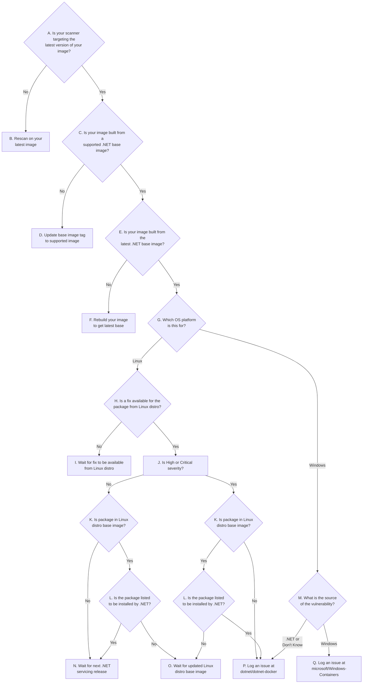

# Determining Action for Container Vulnerabilities

This documented is intended to help guide you to the appropriate course of action when encountering reported vulnerabilities in the .NET container images.
The flowchart below describes a series of questions to help determine the state of the image being reported upon.
By answering each question, it will eventually direct you to the action to help resolve your vulnerability.

Prerequisites:

* Dockerfile of the image being reported upon
  * Name of the .NET base image from that Dockerfile (e.g. `mcr.microsoft.com/dotnet/aspnet:6.0`)
* Architecture of the image being reported upon (e.g. `amd64`)
* Whether the image is a [Linux or Windows image](#how-can-i-determine-whether-my-image-is-based-on-linux-or-windows)
  * For Linux images, it's also important to [know the Linux distro](#how-can-i-determine-the-os-version-of-an-image) (e.g. `Debian`, `Alpine`, `Ubuntu`)
* [Docker installation](https://docs.docker.com/desktop) to run commands locally



## Flowchart Details

### A. Is your scanner targeting the latest version of your image?

There's no need to spend time analyzing vulnerabilities if they're not based on the latest image, or at least a very recent one.
Each build of an image can potentially bring in newly released package versions which have fixes for the vulnerabilities.

Most image scanning software will output the [image digest](#what-is-an-image-digest) of the image that is being scanned in its report or logs.
Be sure that that digest represents the latest version of your image.
To get the digest of your image, be sure to target a tag that is not a multi-arch/manifest list tag.
Multi-arch tags get resolved to a specific image that is likely tagged with an architecture-specific tag.
[Follow the instructions](#how-do-i-know-if-my-tag-is-multi-arch) for determining if the tag is multi-arch.
You'll want to get the digest of the underlying image appropriate for the given architecture/platform instead.
You can see the digests of all the underlying images of a multi-arch tag by running `docker manifest inspect <image-tag>`

### B. Rescan on your latest image

Rerun the scan of your image using your scanning tool. Ensure you get the latest version of the image by running `docker pull <image-tag>`

### C. Is your image built from a supported .NET tag?

When .NET drops support for an image tag, it means it will no longer be updated, even when there is a new base OS image available.
This means that vulnerabilities will be reported for that image over time if it continues to be used.
Our [supported tag policy](supported-tags.md) provides detailed information about when these tags are no longer supported.
The simple rule to follow: if the tag isn't shown in our [tag listing](supported-tags.md#tag-listing), it's not supported.

### D. Update base image tag to supported image

Switching to a supported base image tag requires knowing the specific tag usage:

* If you're using an out-of-support .NET version, such as .NET 5, you'll need to upgrade your project and Dockerfiles to target a supported version.
* If you're using a patch version tag which which has been replaced by a newer patch version, you'll need to switch to the latest patch version. For example, `6.0.8` => `6.0.9`
* If you're using a version-specific Alpine Linux tag for a version of Alpine that is no longer being maintained via .NET container images, you'll need to move to the latest version. For example, `6.0-alpine3.15` => `6.0-alpine3.16`
* If you're using a tag for a specific Windows version that is no longer supported, you'll need to move to a supported version of Windows. For example, `6.0-nanoserver-20H2` => `6.0-nanoserver-ltsc2022`

See our [supported tag policy](supported-tags.md) for more information.

### E. Is your image built from the latest .NET base image?

TODO: This section needs more work. Ideally it would just use <https://github.com/richlander/lucy> but that needs more work to better support multi-arch tags.

Run one of the scripts below to determine whether your image is built on the latest .NET base image. Provide the [image digest](#what-is-an-image-digest) and tag of the .NET base image (e.g. `mcr.microsoft.com/dotnet/aspnet:6.0`) as input.

An output of `True` means that your image is built from the latest .NET base image.
A value of `False` means it is not built on the latest.

#### Linux

```shell
myImage="<insert-my-image-digest>"
baseImage="<insert-base-image-tag>"

function isBuiltOnLatestBaseImage() {
    echo "Pulling $myImage"
    docker pull $myImage

    local os=$(docker inspect $myImage | jq -r .[0].Os)
    local arch=$(docker inspect $myImage | jq -r .[0].Architecture)

    echo "Getting manifest of $baseImage"
    local baseTagManifest=$(docker manifest inspect $baseImage)
    local mediaType=$(echo $baseTagManifest | jq -r .mediaType)

    local basePullImage=""
    # If the .NET image is a multi-arch tag, we need to get the digest of the underlying image with the matching platform.
    if [[ $mediaType == *"list"* ]]; then
        echo "Resolving multi-arch tag $baseImage to matching platform"
        baseImageDigest=$(echo $baseTagManifest | jq -rc ".manifests[] | select(any(.platform; .os == \"$os\" and .architecture == \"$arch\" )) | .digest")
        
        if [[ -z $baseImageDigest ]]; then
            echo
            echo "ERROR: Could not find a matching platform for the given image." >&2
            return 1
        fi

        # If the image name contains a tag separater, replace the tag with the digest; otherwise, append the digest
        if [[ $baseImage == *":"* ]]; then
            basePullImage="${baseImage%:*}@${baseImageDigest}"
        else
            basePullImage="$baseImage@$baseImageDigest"
        fi
    else
        basePullImage=$baseImage
    fi

    echo "Pulling $basePullImage"
    docker pull $basePullImage
    local baseImageOs=$(docker inspect $basePullImage | jq -r .[0].Os)
    local baseImageArch=$(docker inspect $basePullImage | jq -r .[0].Architecture)

    if [[ $os != $baseImageOs || $arch != $baseImageArch ]]; then
        echo
        echo "ERROR: The given image is not built on the same platform as the .NET base image." >&2
        return 1
    fi

    echo "Comparing image layers"
    local lastLayer=$(docker inspect $basePullImage | jq -r .[0].RootFS.Layers[-1])
    result=$(if docker inspect $myImage | jq -r .[0].RootFS.Layers | grep -q $lastLayer; then echo "True"; else echo "False"; fi)
    echo
    echo "Result: $result"
}
isBuiltOnLatestBaseImage
```

#### PowerShell

```powershell
$myImage = "<insert-my-image-digest>"
$dotnetImage = "<insert-dotnet-base-image-tag>"

docker pull $myImage
docker pull $dotnetImage

$lastLayer = (docker inspect $dotnetImage | ConvertFrom-Json).RootFS.Layers[-1]
(docker inspect $myImage | ConvertFrom-Json).RootFS.Layers.Contains($lastLayer)
```

### F. Rebuild your image to get latest base

Since your image is out of date with the latest version of the .NET base image, rebuilding it will ensure it's up-to-date. Be sure that your workflow explicitly pulls the .NET base image tag rather than using a potentially cached version of it.

### G. Which OS platform is this for?

See [How can I determine whether my image is based on Linux or Windows?](#how-can-i-determine-whether-my-image-is-based-on-linux-or-windows).

### H. Is a fix available for the package from Linux distro?

A quick way to determine whether an updated package is available is by running the following commands:

#### Debian/Ubuntu

```shell
docker pull <image-name>
docker run --rm --entrypoint /bin/sh <image-name> -c "apt update > /dev/null && apt list --upgradable"
```

#### Alpine

```shell
docker pull <image-name>
docker run --rm --entrypoint /bin/sh <image-name> -c "apk update > /dev/null && apk list -u"
```

Each Linux distribution maintains there own version of software components, made available in their package repositories.
Each version of the Linux distro also has its own package repository.
So it's possible that a fixed package may be available in one Linux distro version but not another.
It's necessary to check with the Linux distro security site to determine whether a fix is even available for the particular vulnerability.

Your image vulnerability scanner will output an identifer of the vulnerability. This will typically be a CVE number. (Debian also has its own Debian Security Advisory (DSA) numbers).

* Debian: <https://security-tracker.debian.org/tracker>
* Ubuntu: <https://ubuntu.com/security/cves>
* Alpine: <https://security.alpinelinux.org>

Search for the vulnerability ID on the relevant Linux distro's security site.
If you don't know which Linux distro is relevant for your image, [look up the image tag](https://hub.docker.com/_/microsoft-dotnet) and it will tell you its OS version in the tag listing table.

It's important that you determine whether a fix is available for the specific version of the Linux distro.
For example, a package may have a vulnerability fixed for Debian 11 but not yet available for Debian 10.
While you could configure the Debian 10 container to install that package from the Debian 11 package repository, that doesn't mean the package will actually be compatible.
Doing so is not a supported configuration from .NET's perspective and we will not take such an action with our images.

### I. Wait for fix to be available from Linux distro

.NET is dependent on the Linux distribution maintainers to produce fixed versions of the packages that are contained in the .NET container images.
We can't take any action if a fixed version of the package isn't available from the package repository of the Linux distro version.
Sometimes fixes aren't ever made available because they are low severity or not applicable in container environments.
Questions on this matter should be directed to the relevant Linux distro.

### J. Is High or Critical severity?

The severity of a vulnerability is indicated by its Common Vulnerability Scoring System (CVSS) base score.
To find this score, search for the CVE at the [CVE site](https://www.cve.org/SiteSearch).
The score will consist of both a number and a label.
Note whether the label indicates "High" or "Critical".

### K. Is package in Linux distro base image?

It's important to determine whether the Linux package in question is installed by the layers of the Linux distro base image or by the layers of the .NET image.
You'll need to [determine the image tag of the Linux distro base image](#how-can-i-determine-the-tag-of-the-linux-distro-image-that-my-image-is-based-upon). Next, determine 


## Appendix

### What is an image digest?

An image digest is a unique identifier for the image.
It allows you to retrieve that specific image and know that you're getting the same version as someone else that also used that same image digest.
Contrast image digests with image tags which are mutable and cannot be relied upon for ensuring you're getting the exact version of the image you need.
An image tag can be updated multiple times over its lifetime to point to different image digests.

An image digest is a SHA256 value and has the form `sha256:<value>`.
In order to pull an image by its digest, you need to know its registry, repository name, and digest.
The digest is appended to the repository name, separated by an `@` symbol: (e.g.
`mcr.microsoft.com/dotnet/samples@sha256:1983d7d0dec846cb92e59fb01eaa3e7f3a65071ca29c7db4075edefcf20db47a`).

### How can I determine whether my image is based on Linux or Windows?

1. If you're using Docker Desktop for Windows, [change your settings](https://docs.docker.com/desktop/settings/windows/) to target Linux containers.

1. Run the following command:

    ```shell
    docker pull <insert-my-image-digest>
    ```

1. If the previous command pulled the image successfully, it is a Linux image. If you get the error "image operating system "windows" cannot be used on this platform", it is a Windows image.

### How can I determine if my tag is multi-arch?

Run one of these commands:

#### Linux

```shell
docker manifest inspect <image-tag> | jq -r .mediaType
```

#### PowerShell

```powershell
(docker manifest inspect <image-tag> | ConvertFrom-Json).mediaType
```

If the value returned from the command contains "manifest.list", then the tag is multi-arch.

### How can I determine the tag of the Linux distro image that my image is based upon?

You'll first need to get the name of the .NET base image (e.g. `mcr.microsoft.com/dotnet/aspnet:6.0`) from your Dockerfile.
Take the tag portion of that image name and search for that tag on the [.NET Runtime Dependencies page](https://hub.docker.com/_/microsoft-dotnet-runtime-deps/) within the appropriate "Linux &lt;architecture&gt; Tags" section.
Navigate to the Dockerfile link associated with that tag.
The first `FROM` line of the Dockerfile will have the name of the Linux distro base image (e.g. `amd64/debian:bullseye-slim`).

### How can I determine the OS version of an image?

Use the appropriate command below to determine the OS version of your image.
If you get an error like the following: `unable to start container process: exec: "/bin/sh": stat /bin/sh: no such file or directory: unknown`, then you're using a security-hardened image which requires a different command.

#### Linux Container Type

```shell
docker run --rm <image-name> cat /etc/os-release
```

#### Windows Container Type

```shell
docker image inspect --format "{{ .OsVersion }}" <image-name>
```

#### Linux Hardened Images

Since Linux hardened images have no shell with which to run the commands above, you can use the following command to determine the OS version (requires the use of [Syft](https://github.com/anchore/syft)):

##### Linux

```shell
syft packages --output json -q <image-name> | jq -r .distro
```

##### PowerShell

```powershell
(syft packages --output json <image-name> | ConvertFrom-Json).distro
```

### How can I determine what Linux package version is installed?

Use the appropriate command below to determine the package version installed in your image.
If you get an error like the following: `unable to start container process: exec: "/bin/sh": stat /bin/sh: no such file or directory: unknown`, then you're using a security-hardened image which requires a different command.

#### Debian/Ubuntu Images

```shell
docker run --rm --entrypoint /bin/sh <image-name> apt list <package-name>
```

#### Alpine Images

```shell
docker run --rm --entrypoint /bin/sh <image-name> apk list <package-name>
```

#### Hardened Images

Since hardened images have no shell with which to run the commands above, you can use the following command to determine the package version (requires the use of [Syft](https://github.com/anchore/syft)):

##### Linux

```shell
syft packages --output json -q <image-name> | jq -rc ".artifacts[] | select(.name == \"zlib\") | .version"
```

##### PowerShell

```powershell
((syft packages --output json <image-name> | ConvertFrom-Json).artifacts | Where-Object { $_.name -eq "zlib" }).version
```
