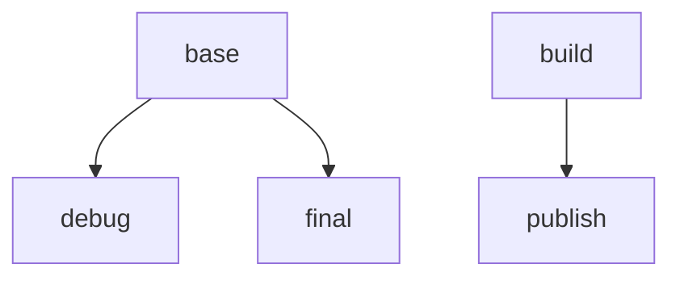

# Debugging with Container Fast Mode

In order to reduce image size and attack surface, .NET Runtime images do not contain the tools required to debug .NET apps using Visual Studio.
The easiest way to enable local Visual Studio debugging while not modifying the production image is to use [Container Fast Mode](https://learn.microsoft.com/en-us/visualstudio/containers/container-build#debugging).

To enable Container Fast Mode debugging without affecting your app's production image, you can create a new stage based off the `base` stage (called `debug` in the example) that contains the debugging tools, and then point the VS Fast Mode tools to that debug stage.

Here's an example chart showing the inheritance of the build stages: 



Here's an example configuration based off of a simple ASP.NET Core app:

**.csproj**
```diff
<PropertyGroup>
  ...
+ <DockerfileFastModeStage>debug</DockerfileFastModeStage>
  ...
</PropertyGroup>
```

**Dockerfile**
```diff
# Learn about building .NET container images:
# https://github.com/dotnet/dotnet-docker/blob/main/samples/README.md
FROM mcr.microsoft.com/dotnet/aspnet:8.0-cbl-mariner2.0 AS base
- USER $APP_UID
WORKDIR /app
EXPOSE 8080
EXPOSE 8081

+ # this stage is used by VS for fast local debugging; it does not appear in the final image
+ FROM base AS debug
+ RUN tdnf install -y procps-ng # <-- Install tools needed for debugging (e.g. the `pidof` command)

FROM mcr.microsoft.com/dotnet/sdk:8.0-cbl-mariner2.0 AS build
ARG BUILD_CONFIGURATION=Release
WORKDIR /src
COPY ["aspnetapp/aspnetapp.csproj", "aspnetapp/"]
RUN dotnet restore "./aspnetapp/aspnetapp.csproj"
COPY . .
WORKDIR "/src/aspnetapp"
RUN dotnet build "./aspnetapp.csproj" -c $BUILD_CONFIGURATION -o /app/build

FROM build AS publish
ARG BUILD_CONFIGURATION=Release
RUN dotnet publish "./aspnetapp.csproj" -c $BUILD_CONFIGURATION -o /app/publish /p:UseAppHost=false

FROM base AS final
WORKDIR /app
COPY --from=publish /app/publish .
+ # Make sure non-root user is enabled after the debug stage so that we have permission to install the debug dependencies
+ USER $APP_UID
ENTRYPOINT ["dotnet", "aspnetapp.dll"]
```

If this example doesn't work for your scenario, see [Container Tools build properties](https://docs.microsoft.com/en-us/visualstudio/containers/container-msbuild-properties?view=vs-2022) for more information on
customizing the Fast Mode stage, or setting a custom `DockerDebuggeeKillProgram`.
